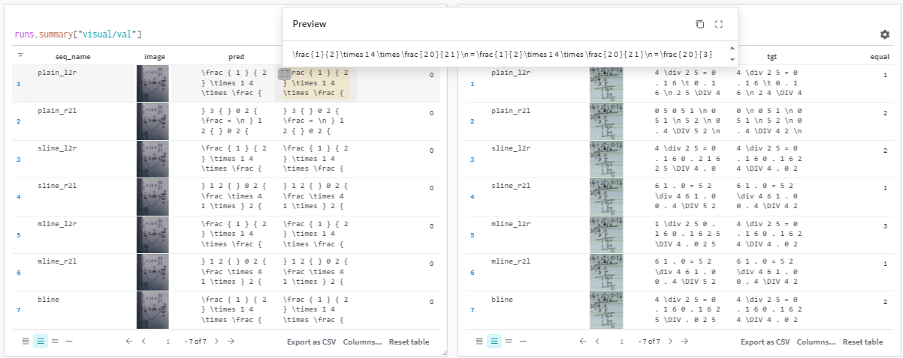

## 简介
这是一个基于PyTorch Lightning构建的OCR的训练框架，用于复现各种OCR论文，以及一些属于自己的创新。  

    

 

## 主要特性
- 使用 PyTorch Lightning 构建，代码结构清晰
- 支持 Weights & Biases (wandb) 实验跟踪
- 灵活的配置系统，支持 YAML 配置和命令行参数
- 支持模型断点保存和恢复
- 支持混合精度训练
- 自动记录训练指标

## 项目结构
- `README.md`：项目的总体说明文档。
- `models/`：包含模型文件。
  - `HG_LAST/`：hugging face版本的LAST，用于训练
  - `KV_LAST/`：用于LAST的kv cache推理（pt）
  - `KV_LAST_ONNX/`：用于LAST的模型导出，以支持onnx的kv cache推理（ONNX）
  - `LAST/`：原版LAST
- `tools/`：包含数据集、LightningModule构建、Loss函数定义等
  - `datasets/`：数据集处理
  - `losses/`：自定义loss
  - `pl_tools/`：LightningModule构建
- `test_dir/`：用于存放测试数据与输出内容。
- `train_*.py`：用于启动训练
- `predict_*.py`：用于推理 custom data
- `export_*.py`：用于转换ONNX
- `configs/config.md`：[config.md](configs/config.md)
- `down_dataset.py`：用于下载M2E数据集
- `test.py`：用于计算验证集或者测试集的ExpRate
- `test_dataset.py`：用于各种杂乱测试

## 项目清单
- [x] 新增export_*.py, 用于转换模型为ONNX，且支持kv cache推理
- [x] 整理ExpRate计算代码：test.py
- [x] 实现LAST的 KV cache推理, **last的单行单端解码与多行双端解码 ===> 复现成功！**
- [x] 实现LAST的 KV cache版本的训练（引入hugging face的transformer源码）
- [ ] 上传训练好的模型
- [ ] 合并pt版本的kv cache推理与onnx版本的kv cache推理

## 已复现论文
| **方法名称** | **配置文件** | **数据集** | **论文** | **原文代码** |
| --- | --- | --- | --- | --- |
| LAST | config_last_m2edataset.yaml | [paper](https://dl.acm.org/doi/abs/10.1145/3581783.3612499) | [code](https://github.com/HCIILAB/LAST) |

